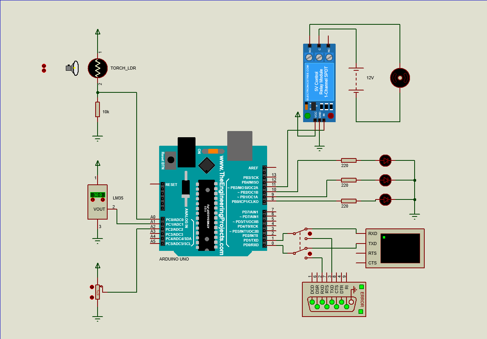
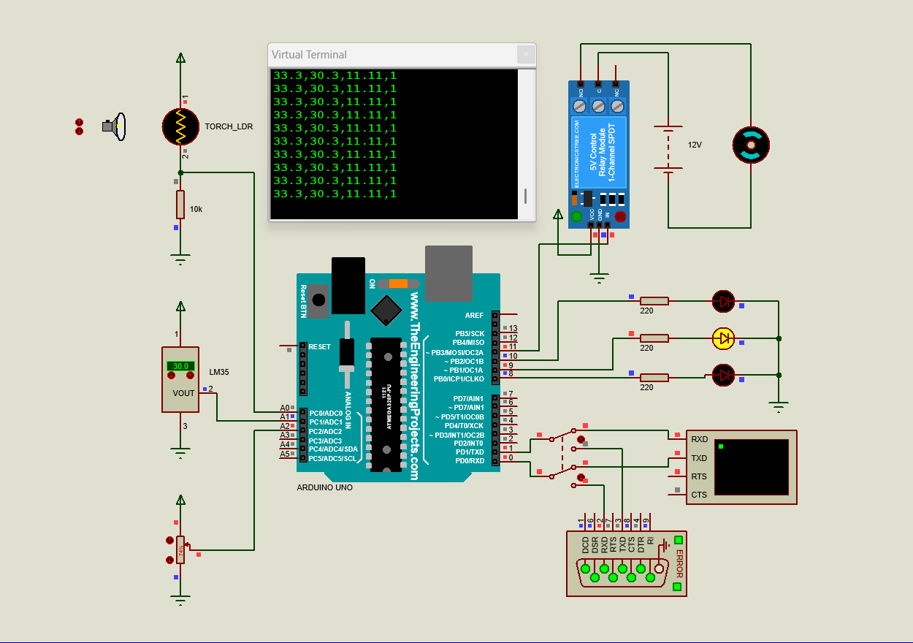
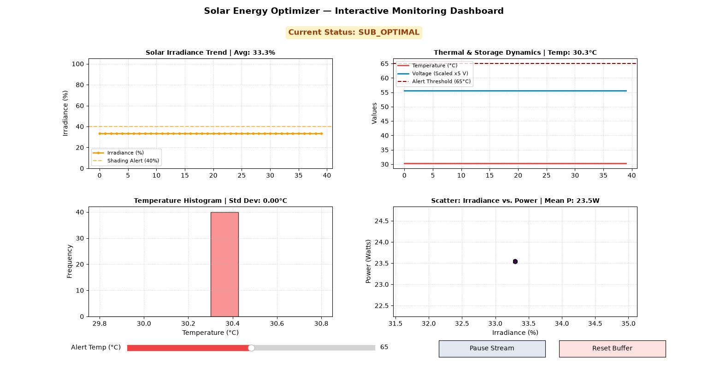
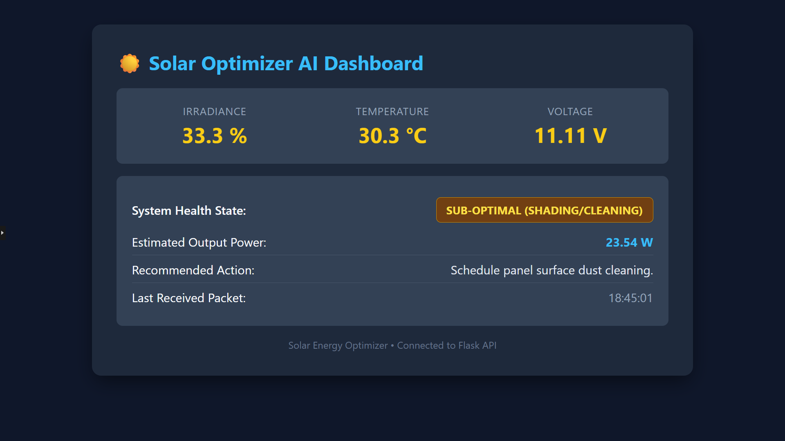
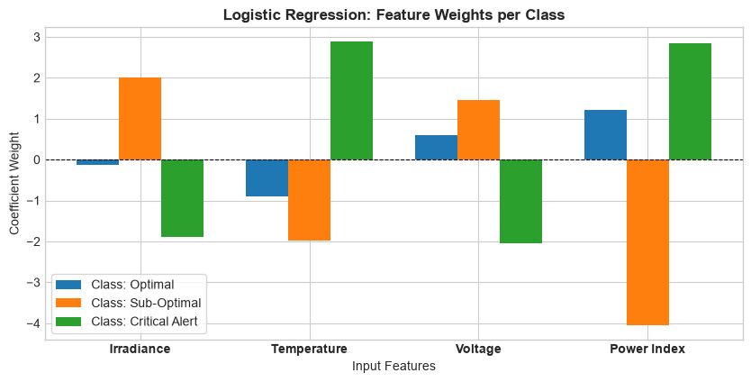
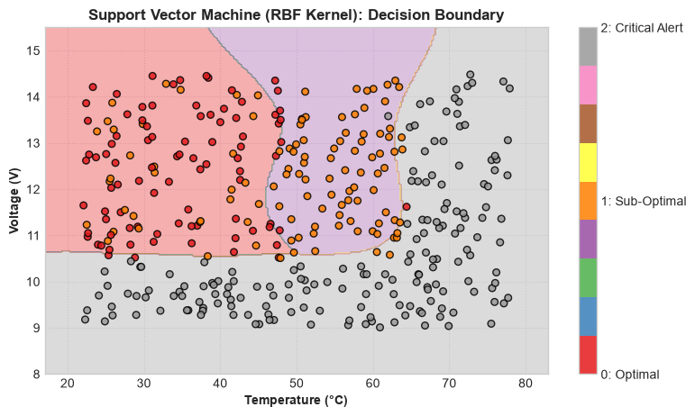
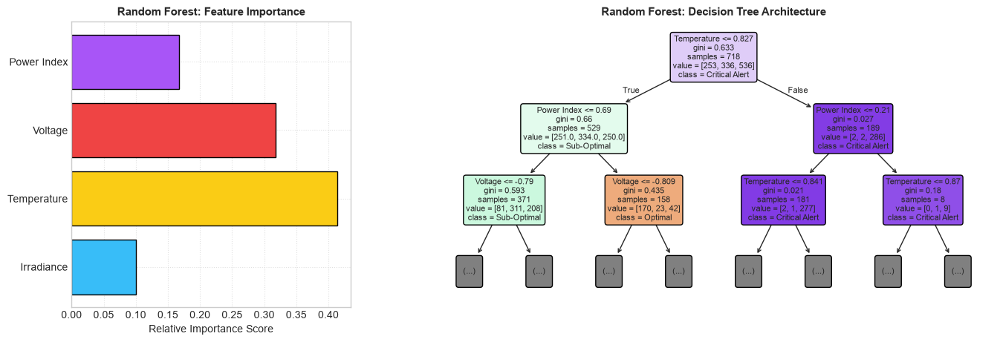
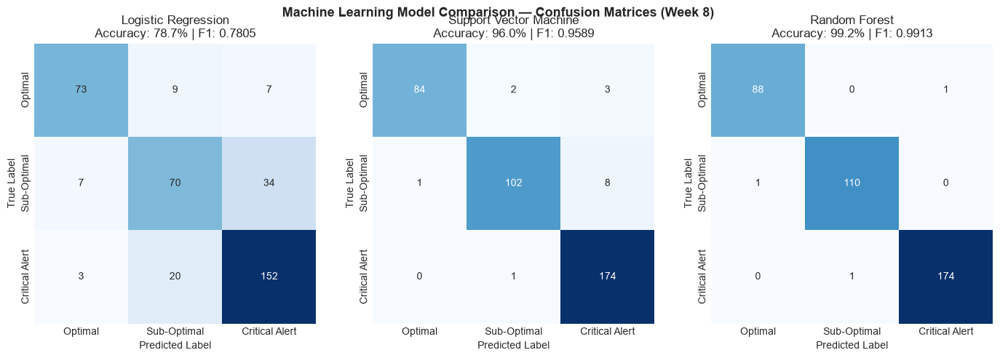

<div align="center">

# ☀️ Solar Energy Optimizer

### AI-Powered Solar Health Monitoring, Predictive Diagnosis, and Live Optimization Insights

[](https://www.arduino.cc/)
[](https://scikit-learn.org/)
[](https://isocpp.org/)
[](http://127.0.0.1:5000/)
[](https://www.labcenter.com/)

</div>

> AI For Engineering Project | Maker Internship Program 2026
>
> **ITIDA · EME Innovation Labs — Giza · Supervised by Origin Integrated Systems (OIS)**

This project turns raw solar telemetry into actionable intelligence. It combines embedded sensing, machine learning, and real-time monitoring to detect system health, estimate power output, and trigger safe operating actions under abnormal conditions.

## 👥 Team

- Islam Ahmed Nabil Asar

## 🎓 Educational Context

This project demonstrates the practical integration of embedded sensing, telemetry acquisition, data engineering, and AI-driven diagnostics in the **AI for Engineering** track of the **EME Initiative**. It connects low-level data collection with Python-based analytics and web visualization in a single workflow.

## 🔭 Overview

The **Solar Energy Optimizer** is an end-to-end cyber-physical system designed to maximize solar power efficiency and protect the electrical load from thermal or voltage-related faults.

The workflow includes:

- ☀️ **Live telemetry acquisition** from irradiance, temperature, and voltage sensors.
- 🧠 **AI-based state classification** using a trained machine-learning model and a derived power index.
- ⚠️ **Fault detection logic** that marks operating conditions as optimal, sub-optimal, or critical.
- 📈 **Monitoring and reporting** through a Matplotlib dashboard and a Flask web dashboard.
- 💾 **Historical logging** to CSV for replay, model retraining, and debugging.

## 🧭 Quick Navigation

- [✨ Project Highlights](#-project-highlights)
- [📊 System Behavior](#-system-behavior)
- [🔩 Hardware Specifications](#-hardware-specifications)
- [🧠 AI Model and Decision Logic](#-ai-model-and-decision-logic)
- [📈 Machine Learning Pipeline & Performance Evaluation](#-machine-learning-pipeline--performance-evaluation)
- [💻 Software Setup](#-software-setup)
- [🚀 Build and Run](#-build-and-run)
- [✅ Verification](#-verification)
- [🚀 Future Enhancements](#-future-enhancements)
- [📁 Repository Contents](#-repository-contents)
- [🙏 Acknowledgements](#-acknowledgements)

## ✨ Project Highlights

- ☀️ Real-time tracking of irradiance, temperature, and voltage.
- 🧠 AI classification of solar health into `OPTIMAL`, `SUB_OPTIMAL`, and `CRITICAL_ALERT` states.
- ⚡ Embedded safety logic with relay-based load cutoff during critical conditions.
- 📊 Model comparison across Logistic Regression, SVM, and Random Forest classifiers.
- 🌐 Dual monitoring interfaces: desktop dashboard and Flask web dashboard.
- 🧪 Proteus simulation with virtual serial communication and real-time telemetry streaming.
- 💾 Exportable trained artifacts for deployment and edge-style inference.

---

## 📊 System Behavior

The optimizer classifies operational conditions into three main states according to irradiance, temperature, and voltage patterns.

| Operating condition | Telemetry pattern | AI diagnosis | Recommended response |
| :--- | :--- | :--- | :--- |
| **Optimal generation** | High irradiance, stable voltage, nominal temperature | `OPTIMAL GENERATION` | Maintain active tracking and normal operation |
| **Sub-optimal output** | Mild thermal increase or reduced irradiance | `SUB-OPTIMAL (SHADING/CLEANING)` | Inspect shading, dust, or panel cleanliness |
| **Critical alert** | High temperature or severe voltage sag | `CRITICAL ALERT (OVERHEAT/LOW VOLT)` | Trigger load disconnection and cooling actions |

---

### 📸 Project Deliverables & Visual Gallery

**1. Schematic & Circuit Architecture**
> **Proteus Circuit Simulation (`Solar Energy Optimizer.pdsprj`)**
>
> Features: ATmega328P MCU, LDR (A0), LM35 (A1), voltage proxy (A2), tri-color status LEDs (D8, D9, D10), safety relay driver (D11), and virtual serial interface (COM1 ↔ COM2 at 9600 baud).

<div align="center">
  
</div>

---

**2. Hardware / Simulation Build in Action**
> **Running State Telemetry & Safety Actuation**
>
> Shows live telemetry streaming, LED state reflection, and automatic relay disconnect when the system enters a critical operational state.

<div align="center">
  
</div>

---

**3. Real-Time Telemetry & Monitoring Dashboards**

A. Interactive Matplotlib Desktop Dashboard (OOP-Driven)
> Features a high-throughput 2x2 dashboard with rolling telemetry buffers, threshold lines, and live state indicators.

<div align="center">
  
</div>

B. Flask Web Telemetry & AI Diagnosis Dashboard (REST API)
> The Flask app exposes live telemetry gauges, model diagnosis cards, and recommended repair or maintenance responses in a browser-based dashboard.

<div align="center">
  
</div>

---

## 🔩 Hardware Specifications

- Arduino Uno / ATmega328P microcontroller
- LDR sensor for approximate irradiance
- LM35 temperature sensor
- Voltage proxy via potentiometer / analog measurement
- Tri-color status LEDs for system state indication
- Relay driver for emergency load cutoff
- Virtual serial interface using Proteus COMPIM
- Local Python environment for analytics and dashboard hosting

### 🧩 Hardware Architecture & Interfacing

**Microcontroller Pinout (ATmega328P / Arduino Uno)**

| Component | Pin | Type | Signal Description / Operational Range |
| :--- | :---: | :---: | :--- |
| **LDR Sensor** | `A0` | Analog In | Solar irradiance proxy (0.0% - 100.0%) |
| **LM35 Sensor** | `A1` | Analog In | Panel/ambient temperature (10 mV/°C, 0 - 100 °C) |
| **Voltage Proxy** | `A2` | Analog In | Battery / bus voltage proxy (0.0 - 15.0 V) |
| **Green LED** | `D8` | Digital Out | `OPTIMAL` state indicator |
| **Yellow LED** | `D9` | Digital Out | `SUB_OPTIMAL` warning indicator |
| **Red LED** | `D10` | Digital Out | `CRITICAL_ALERT` emergency indicator |
| **Relay Driver** | `D11` | Digital Out | Emergency load cutoff (HIGH: connected, LOW: cutoff) |
| **COMPIM (RX)** | `D0` | Serial RX | Virtual serial reception from host |
| **COMPIM (TX)** | `D1` | Serial TX | Telemetry stream to host (`irradiance,temp,volt,state`) |

**Telemetry Packet Definition**

The telemetry stream is transmitted continuously over UART at **9600 bps**:

```text
<irradiance_percent>,<temperature_celsius>,<voltage_volts>,<state_code>

Example: 33.3,30.3,11.11,1
```

---

## 🧠 AI Model and Decision Logic

The optimizer classifies operating conditions into three deterministic states.

| Class Code | Operational State | Sensor Pattern | Derived Power Index | System Response |
| :---: | :--- | :--- | :---: | :--- |
| `0` | **OPTIMAL GENERATION** | High irradiance, nominal temperature, stable voltage | High | Load stays connected and tracking remains active |
| `1` | **SUB-OPTIMAL (SHADING/DUST)** | Lower irradiance or slightly elevated temperature | Medium | Warning state and maintenance recommendation |
| `2` | **CRITICAL ALERT (OVERHEAT/FAULT)** | High temperature or severe voltage sag | Low | Emergency cutoff and protection action |

The derived power index is calculated using:

$$
Power\;Index = \frac{Irradiance \times Voltage}{Temperature + 1.0}
$$

---

## 📈 Machine Learning Pipeline & Performance Evaluation

### A. Linear Model Weights
> Feature coefficient interpretation for the linear classifier, showing how each input contributes to class separation.

<div align="center">
  
  <p><em>Figure 1.5: Logistic Regression feature weights per class.</em></p>
</div>

### B. SVM Decision Boundary (RBF Kernel)
> 2D non-linear separation boundary between temperature and voltage states, highlighting the learned healthy and fault regions.

<div align="center">
  
  <p><em>Figure 1.6: Non-linear SVM decision boundary mapping telemetry to health states.</em></p>
</div>

### C. Feature Importance & Random Forest Decision Architecture
> Explains how the derived power index and thermal limits govern classification splits and model interpretability.

<div align="center">
  
  <p><em>Figure 1.7: Random Forest feature importance ranking and top-level decision tree architecture.</em></p>
</div>

### D. Model Comparison Confusion Matrices
> 5-fold cross-validated evaluation comparing Logistic Regression, SVM, and Random Forest.

<div align="center">
  
  <p><em>Figure 1.8: 5-fold cross-validation confusion matrices for Logistic Regression, SVM, and Random Forest.</em></p>
</div>

### Benchmark Summary

| Model Family | Hyperparameters Tuned | Test Accuracy | Macro Precision | Macro Recall | Macro F1-score |
| :--- | :--- | :---: | :---: | :---: | :---: |
| **Logistic Regression** | `C=1.0`, `solver=lbfgs` | 78.67% | 0.7914 | 0.7731 | 0.7805 |
| **Support Vector Machine** | `C=5.0`, `kernel=rbf`, `gamma=scale` | 96.00% | 0.9667 | 0.9523 | 0.9589 |
| **Random Forest (Winner 🏆)** | `n_estimators=100`, `max_depth=8` | **99.20%** | **0.9913** | **0.9913** | **0.9913** |

---

## 💻 Software Setup

### Required Python packages

```bash
pip install numpy pandas matplotlib seaborn scikit-learn joblib flask requests pyserial
```

### Recommended workflow

- Install Jupyter Notebook or VS Code with the Python extension.
- Use a virtual COM pair such as `COM1` ↔ `COM2` for serial communication.
- Start the Flask API before the serial bridge so incoming data can be processed consistently.

## 🚀 Build and Run

### 1) Start the AI API server

```bash
python flask_api_server.py
```

The server exposes:

- `GET /` → live dashboard
- `POST /api/predict` → direct prediction for telemetry payloads
- `POST /api/telemetry` → ingest telemetry and return AI diagnosis
- `GET /api/latest` → latest telemetry and state
- `GET /api/health` → health check

### 2) Launch the serial bridge

```bash
python serial_bridge.py
```

This reads serial data from the configured port and sends each frame to the Flask API.

### 3) Run the Proteus simulation

Open `Solar Energy Optimizer.pdsprj` and start the simulation. The serial stream feeds the bridge and the dashboard updates automatically.

### 4) Train or retrain the ML model

Open `train_ml_pipeline.ipynb` and run each cell from top to bottom to regenerate the trained model and scaler if needed.

---

## ✅ Verification

After launching the system, verify the following:

- Health endpoint responds successfully at `/api/health`
- Dashboard loads and updates with incoming real-time telemetry
- Serial bridge forwards values without errors
- Model output changes correctly as temperature and voltage vary
- Relay-based cutoff triggers in the critical operating state

A typical validation path is:

1. Start the API server.
2. Launch the serial bridge.
3. Run the Proteus simulation.
4. Open the dashboard in the browser.
5. Confirm that state name, power estimate, and recommended action update correctly.

---

## 🚀 Future Enhancements

- Add panel current and humidity sensing for a richer feature set.
- Integrate weather forecasting for proactive optimization.
- Extend the model to predict long-term degradation and maintenance windows.
- Add cloud storage and database-backed telemetry history.
- Introduce MPPT optimization and intelligent load scheduling.
- Add a mobile-friendly dashboard and push notifications.

---

## 📁 Repository Contents

```text
Solar Energy Optimizer/
├── README.md                                 # Project overview, setup steps, and usage guide
├── Images/                                   # Generated plots, simulation screenshots, and visual artifacts
│   ├── circuit_schematic.png                 # Proteus schematic capture
│   ├── hardware_simulation_photo.png         # Hardware/simulation build image
│   ├── sensor_dashboard_matplotlib.png       # Desktop telemetry dashboard snapshot
│   ├── flask_dashboard_ui.png                # Flask dashboard interface screenshot
│   ├── logistic_regression_weights.png       # Linear model weight visualization
│   ├── svm_decision_boundary.png             # SVM decision-boundary plot
│   ├── random_forest_importance_tree.png     # Feature importance and tree structure
│   └── confusion_matrices_comparison.png     # ML benchmark confusion matrices
├── arduino_serial_bridge/                    # Supporting Arduino/serial bridge resources
├── flask_api_server.py                       # Flask API and dashboard for live telemetry + AI diagnosis
├── serial_bridge.py                          # Reads serial sensor data and forwards it to the API
├── sensor_dashboard.ipynb                    # Interactive monitoring notebook
├── train_ml_pipeline.ipynb                   # Training, evaluation, and artifact export notebook
├── sensor_log.csv                            # Historical telemetry log and state annotations
├── solar_optimizer_model.pkl                 # Trained ML model artifact
├── solar_scaler.pkl                          # StandardScaler fitted object
└── Solar Energy Optimizer.pdsprj             # Proteus project file for the solar simulation
```

---

## 🙏 Acknowledgements

This project was developed as part of the **Maker Internship Program 2026** under the **EME Innovation Labs** initiative. Special thanks to the mentors and supporting teams that enabled applied work in embedded systems, data science, and AI-based engineering.
